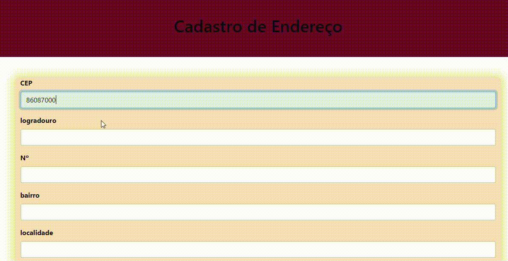

# CADASTRO DE ENDEREÇO

## DESCRIÇÃO
Este projeto é um formulário simples para registrar endereços, permitindo que os usuários insiram informações necessárias sobre seu local de residência.

## INTRODUÇÃO
A estrutura do Formulário contém os seguintes campos:

* CEP: Campo para o Código de Endereçamento Postal (CEP). Deve ser preenchido com um código numérico.

* Rua: Campo para o nome da rua. O tipo do campo é text, pois espera-se que o usuário insira o nome da rua.

* Nº: Campo para o número da residência. Também é um campo de texto.

* Bairro: Campo para o nome do bairro. Deve ser preenchido com um texto.

* Complemento: Campo opcional para informações adicionais sobre o endereço, como apartamento ou bloco.

* Cidade: Campo para o nome da cidade.

* Estado: Campo para o nome do estado ou província.

## FUNCIONALIDADES
* Botão de Ação
* Salvar: Ao clicar neste botão, a função salvarUser() é chamada. Essa função deve ser implementada em um arquivo JavaScript (por exemplo, endereco.js) para processar os dados do formulário.
Considerações Técnicas
* HTML: O formulário é construído com elementos HTML padrão e classes do Bootstrap para um estilo responsivo e amigável.
* JavaScript: O arquivo endereco.js deve conter a lógica para coletar os dados do formulário e realizar as operações necessárias, como validação ou envio para um servidor.

# Função para consumo de API ViaCEP
Esse código JavaScript cria uma função que busca informações sobre um endereço a partir de um CEP (Código de Endereçamento Postal) brasileiro. Quando você digita um CEP em um campo HTML e sai dele (evento `focusout`), a função é acionada e faz uma requisição a uma API (ViaCEP) para obter os dados do endereço correspondente.

# Limpar formulário:
Antes de cada pesquisa, o formulário é limpo para garantir que os dados da pesquisa anterior não interfiram na nova pesquisa.
# Montar a URL:
 A função cria uma URL completa para a API ViaCEP, incluindo o CEP informado pelo usuário.
# Verificar CEP:
 O CEP é validado para garantir que tenha o formato correto.
# Fazer a requisição:
 Se o CEP for válido, a função faz uma requisição à API usando o método `fetch`.
# Receber os dados:
A resposta da API, que contém as informações do endereço, é convertida para formato JSON e armazenada na variável `addres`.
# Verificar erro:
Se a API retornar um erro (CEP não encontrado), um alerta é exibido.
# Preencher formulário:
Caso contrário, os dados do endereço são usados para preencher os campos correspondentes no formulário HTML.
# `focusout`:
 A função `pesquisarCEP` é associada ao evento `focusout` do campo CEP. Isso significa que a função será executada automaticamente sempre que o usuário sair do campo CEP.

# PARA QUE SERVE?
Esse tipo de código é muito útil em formulários de cadastro ou pesquisa, onde é necessário obter informações sobre um endereço de forma rápida e automatizada. Ao invés de o usuário ter que preencher manualmente todos os campos do endereço, ele pode simplesmente digitar o CEP e o sistema se encarrega de buscar as demais informações.

* API: Uma interface de programação de aplicativos que permite que diferentes softwares se comuniquem entre si.
* Fetch: Uma função do JavaScript que permite fazer requisições HTTP para servidores.
* JSON: Um formato de texto leve para troca de dados.
* Evento: Uma ação que ocorre em um elemento HTML, como clicar em um botão ou sair de um campo de texto.

# OBSERVAÇÕES
* API ViaCEP: A API ViaCEP é um serviço gratuito que fornece informações sobre endereços brasileiros.
* Asynchronous JavaScript: O uso do `async/await` torna o código mais fácil de ler e entender, pois permite tratar o código assíncrono de forma mais síncrona.
* Validação do CEP:É importante validar o CEP para evitar erros e garantir que a pesquisa seja feita corretamente.
